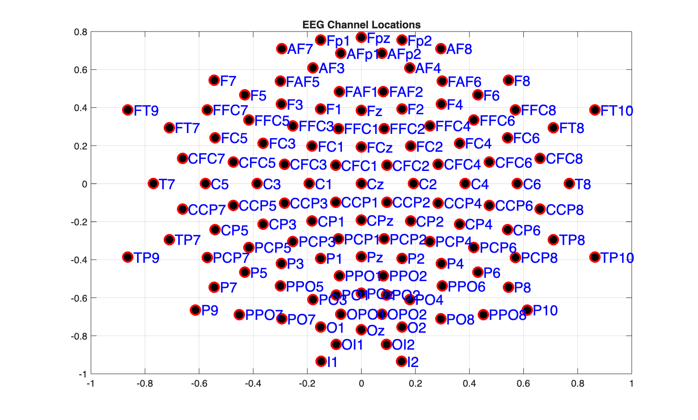
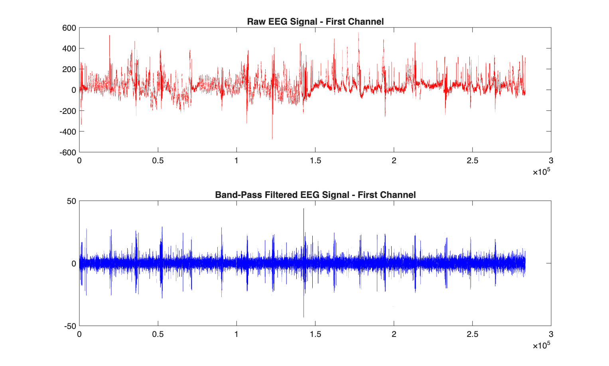
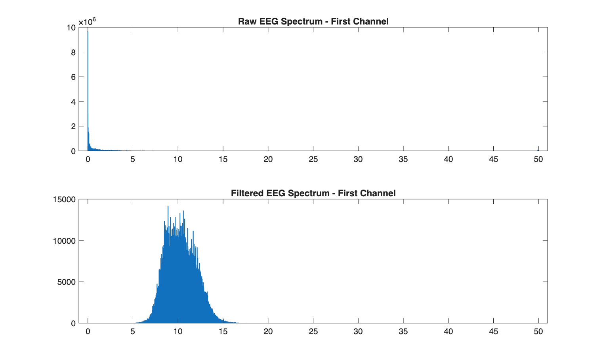

# EEG Motor Imagery Classification using CSP (MATLAB)

A complete MATLAB pipeline for **EEG-based motor imagery classification** using signal processing, Common Spatial Patterns (CSP), and machine learning.

This work is based on **BCI Competition III – Dataset IVa**. Read the [Dataset description](https://www.bbci.de/competition/iii/desc_IVa.html)

This project implements a full Brain-Computer Interface (BCI) pipeline to classify **motor imagery EEG signals** (Right Hand vs Foot).

The objective is to transform raw EEG signals into discriminative features and evaluate multiple classifiers.

---
## How to Run

1- Download the dataset from [BCI Competition III – Dataset IVa](https://www.bbci.de/competition/iii/)

2- Open MATLAB

3- Start by loading one of the subjects. ` data_set_IVa_al.mat ` is chosen here.

4- Run: ` run_pipeline.m `


---

## Configuration
Inside `run_pipeline.m`, you can modify:
``` 
config.dataset_path = 'data_set_IVa_al.mat';
config.frequency_band = 'mu';        % options: 'mu', 'mu_beta', 'mu_beta_gamma'
config.spatial_filter = 'CAR';       % options: 'CAR', 'Low Laplacian', 'High Laplacian'
config.filter_order = 3;
config.train_ratio = 0.70;
config.num_csp_pairs = 1;
config.trial_length_s = 3.5;
config.plot_figures = true;
config.visualise_csp = true;
```
## EEG Channel Layout


## Pipeline Overview

### 1. Frequency Filtering

Band-pass filtering isolates motor-related rhythms:

- μ band: 8–13 Hz
- β band: 13–30 Hz
- γ band: 13–49.9 Hz     (Limited by Nyquist when fs = 100 Hz)

#### Plotting example time-domain signal:


#### Plotting frequency-domain signal:



### 2. Spatial Filtering

Implemented spatial filters:

- [`apply_spatial_filter.m`](apply_spatial_filter.m) (main interface)  
- [`car_filter.m`](car_filter.m) (CAR)  
- [`laplacian_low.m`](laplacian_low.m) (Low Laplacian)  
- [`laplacian_high.m`](laplacian_high.m) (High Laplacian)  

These filters enhance spatial resolution and reduce noise.

### 3. Common Spatial Patterns (CSP)

Implemented in: 
[`compute_csp_filters.m`](compute_csp_filters.m) (compute_csp_filters) 

CSP finds spatial filters that maximize variance differences between classes.

The animation below shows:

- Raw EEG → mixed distributions
- After CSP → separable structure
- Feature space → class separation


### 4. Feature Extraction

Variance of CSP-projected signals is used as features:

```text
features(:, trial_idx) = var(projected_signal, 0, 2); 
```

### 5. Classification

Three classifiers are implemented:

- Support Vector Machine (SVM)
- K-Nearest Neighbors (KNN)
- Linear Discriminant Analysis (LDA)

## Results
### Accuracy Comparison
| Classifier | Accuracy |
|-----------|----------|
| SVM       | 70.59%   |
| KNN       | 77.94%   |
| LDA       | 73.53%   |

## Key Insights
- KNN achieved the best performance (77.94%), suggesting:
   - The feature space is locally well-structured
   - CSP features cluster effectively
- LDA required pseudo-linear mode due to:
   - Low-dimensional feature space
   - Potential zero-variance features
- SVM performed slightly lower, likely due to:
   - Limited feature dimensionality
   - No kernel tuning (baseline setup)
 
